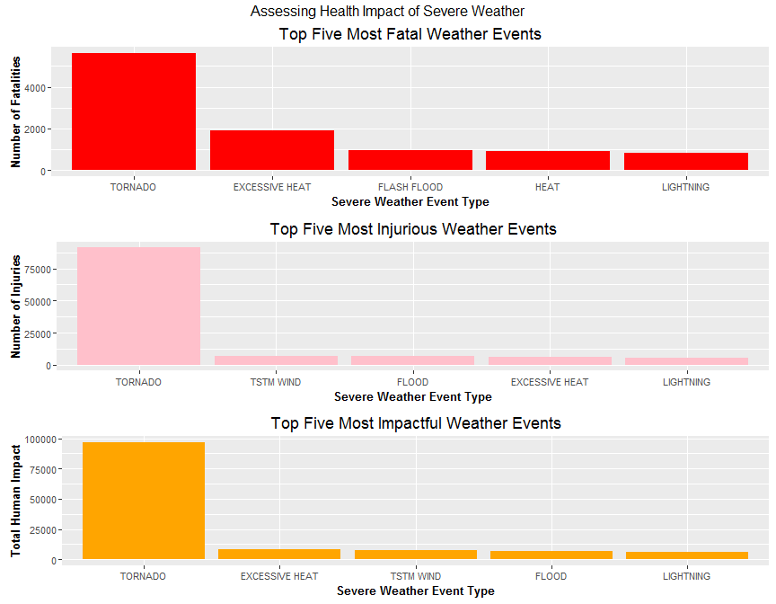
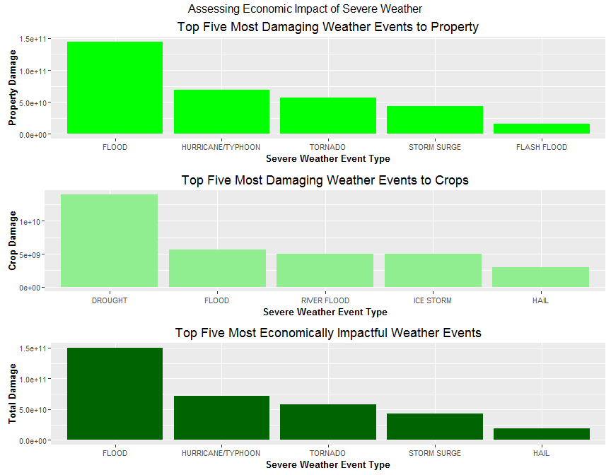

# Analyzing severe weather events and their impacts on the population in both human and economic terms. Impact on humans is measured through an assessment of fatalities and injuries, while economic impact is measured monetarily through damage to property and crops.
EduardoAbreu  
March 16, 2016  

===============================================================================

#Synopsis

From the class project description: "this project involves exploring the U.S. National Oceanic and Atmospheric Administration's (NOAA) storm database. This database tracks characteristics of major storms and weather events in the United States, including when and where they occur, as well as estimates of any fatalities, injuries, and property damage."

Using this data, we explore to determine the health and economic impacts  of severe weather events on people and places.

As per the assignment:

1. Across the United States, which types of events (as indicated in the EVTYPE variable) are most harmful with respect to population health?

2. Across the United States, which types of events have the greatest economic consequences?

Events started being recorded in the year 1950 and the current dataset comprises data no later than November 2011.

===============================================================================

#Data Processing

##Loading libraries and data

Checking for, and loading if necessary, the relevant libraries.


```r
#Code segment 1

if(!require(R.utils)) {
  install.packages("R.utils") #R.utils package is used for unzipping bz2 files
  library(R.utils)
}
```

```
## Loading required package: R.utils
```

```
## Warning: package 'R.utils' was built under R version 3.2.3
```

```
## Loading required package: R.oo
```

```
## Warning: package 'R.oo' was built under R version 3.2.3
```

```
## Loading required package: R.methodsS3
```

```
## Warning: package 'R.methodsS3' was built under R version 3.2.3
```

```
## R.methodsS3 v1.7.1 (2016-02-15) successfully loaded. See ?R.methodsS3 for help.
```

```
## R.oo v1.20.0 (2016-02-17) successfully loaded. See ?R.oo for help.
```

```
## 
## Attaching package: 'R.oo'
```

```
## The following objects are masked from 'package:methods':
## 
##     getClasses, getMethods
```

```
## The following objects are masked from 'package:base':
## 
##     attach, detach, gc, load, save
```

```
## R.utils v2.2.0 (2015-12-09) successfully loaded. See ?R.utils for help.
```

```
## 
## Attaching package: 'R.utils'
```

```
## The following object is masked from 'package:utils':
## 
##     timestamp
```

```
## The following objects are masked from 'package:base':
## 
##     cat, commandArgs, getOption, inherits, isOpen, parse, warnings
```

```r
if(!require(data.table)) {
  install.packages("data.table") #Is used for speeding up the data loading
  library(data.table)
}
```

```
## Loading required package: data.table
```

```r
if(!require(dplyr)) {
  install.packages("dplyr") #Will be used in creating new columns
  library(dplyr)
}
```

```
## Loading required package: dplyr
```

```
## 
## Attaching package: 'dplyr'
```

```
## The following objects are masked from 'package:data.table':
## 
##     between, last
```

```
## The following objects are masked from 'package:stats':
## 
##     filter, lag
```

```
## The following objects are masked from 'package:base':
## 
##     intersect, setdiff, setequal, union
```

```r
if(!require(reshape2)) {
  install.packages("reshape2") #Will be used in data extraction
  library(reshape2)
}
```

```
## Loading required package: reshape2
```

```
## 
## Attaching package: 'reshape2'
```

```
## The following objects are masked from 'package:data.table':
## 
##     dcast, melt
```

```r
if(!require(ggplot2)) {
  install.packages("ggplot2") #Will be used to create charts
  library(ggplot2)
}
```

```
## Loading required package: ggplot2
```

```
## Warning: package 'ggplot2' was built under R version 3.2.3
```

```r
if(!require(gridExtra)) {
  install.packages("gridExtra") #Used to combine multiple charts into one
  library(gridExtra)
}
```

```
## Loading required package: gridExtra
```

```
## Warning: package 'gridExtra' was built under R version 3.2.4
```

```
## 
## Attaching package: 'gridExtra'
```

```
## The following object is masked from 'package:dplyr':
## 
##     combine
```

Now to load in the data using fread into a variable titled stormdata.


```r
#Code segment 2

fileURL <- "https://d396qusza40orc.cloudfront.net/repdata%2Fdata%2FStormData.csv.bz2"
download.file(fileURL, "StormData.csv.bz2")

if(!file.exists("StormData.csv.bz2")){
  download.file(fileURL, "StormData.csv.bz2")
}

bunzip2(filename = "StormData.csv.bz2", destname = "StormData.csv", overwrite = T)

stormdata <- fread(input = "StormData.csv",
                   stringsAsFactors = F,
                   header = T,
                   sep = ",")
```

```
## 
Read 21.7% of 967216 rows
Read 38.3% of 967216 rows
Read 54.8% of 967216 rows
Read 73.4% of 967216 rows
Read 82.7% of 967216 rows
Read 902297 rows and 37 (of 37) columns from 0.523 GB file in 00:00:08
```

```
## Warning in fread(input = "StormData.csv", stringsAsFactors = F, header =
## T, : Read less rows (902297) than were allocated (967216). Run again with
## verbose=TRUE and please report.
```

Note that when reading in the data, the fread function shows a warning.  Visual inspection of the file (NB: no manipulation) reveals that the way that the data are arranged is what leads to the error and that there is no loss of data as initially feared.

##Time to begin extracting data

Given the two questions that need to be answered (ie health and economic impact of storms), let's take a look at what the column headings tell us about the data.


```r
#Code segment 3
##Part 1
##Seeing what the data's columns have for headings
headings <- colnames(stormdata)

print(headings)
```

```
##  [1] "STATE__"    "BGN_DATE"   "BGN_TIME"   "TIME_ZONE"  "COUNTY"    
##  [6] "COUNTYNAME" "STATE"      "EVTYPE"     "BGN_RANGE"  "BGN_AZI"   
## [11] "BGN_LOCATI" "END_DATE"   "END_TIME"   "COUNTY_END" "COUNTYENDN"
## [16] "END_RANGE"  "END_AZI"    "END_LOCATI" "LENGTH"     "WIDTH"     
## [21] "F"          "MAG"        "FATALITIES" "INJURIES"   "PROPDMG"   
## [26] "PROPDMGEXP" "CROPDMG"    "CROPDMGEXP" "WFO"        "STATEOFFIC"
## [31] "ZONENAMES"  "LATITUDE"   "LONGITUDE"  "LATITUDE_E" "LONGITUDE_"
## [36] "REMARKS"    "REFNUM"
```

From this information, we can identify which columns we need to use.  We were already told that we needed to use EVTYPE to determie what kind of severe weather we are analysing.  Additionally, it looks like we need to also use the following columns: FATALITIES, INJURIES, PROPDMG, PROPDMGEXP, CROPDMG, CROPDMGEXP

These headings show Fatalaties and Injuries (self-explanatory), as well as Property Damage (PROPDMG), its exponent (PROPDMGEXP), Crop Datame (CROPDMG), and its exponent (CROPDMGEXP).

As such, we will pare down the data by creating a variable of the columns to be used and then subsetting the data on that.


```r
#Code segment 3
##Part 2
##Determining which headings are needed aND subsetting the data
needed <- headings[c(8, 23:28)]

pared_stormdata <- subset(stormdata, select = needed)
```

At this point, looking at an extract from the top of the data and from the bottom of the data, we see that the exponents for propery damage and crop damage use letters to denote the units of measure.  From the documentation, we see that "Alphabetical characters used to signify magnitude
include "K" for thousands, "M" for millions, and "B" for billions."

As such, we need to replace the alphabetical values with the corresponding numeric value.  However, by running the unique and intersect operations on the columns, we identify that in some cases the data is input as an upper case letter and in others as a lower case letter.  We will need to control for that when we substitute the alphabetical for the equivalent numeric.


```r
#Code segment 4

head(pared_stormdata)
```

```
##     EVTYPE FATALITIES INJURIES PROPDMG PROPDMGEXP CROPDMG CROPDMGEXP
## 1: TORNADO          0       15    25.0          K       0           
## 2: TORNADO          0        0     2.5          K       0           
## 3: TORNADO          0        2    25.0          K       0           
## 4: TORNADO          0        2     2.5          K       0           
## 5: TORNADO          0        2     2.5          K       0           
## 6: TORNADO          0        6     2.5          K       0
```

```r
tail(pared_stormdata)
```

```
##            EVTYPE FATALITIES INJURIES PROPDMG PROPDMGEXP CROPDMG
## 1: WINTER WEATHER          0        0       0          K       0
## 2:      HIGH WIND          0        0       0          K       0
## 3:      HIGH WIND          0        0       0          K       0
## 4:      HIGH WIND          0        0       0          K       0
## 5:       BLIZZARD          0        0       0          K       0
## 6:     HEAVY SNOW          0        0       0          K       0
##    CROPDMGEXP
## 1:          K
## 2:          K
## 3:          K
## 4:          K
## 5:          K
## 6:          K
```

```r
PropExpUniq <- unique(pared_stormdata$PROPDMGEXP)
CropExpUniq <- unique(pared_stormdata$CROPDMGEXP)

OverLapExp <- intersect(PropExpUniq, CropExpUniq)
print(OverLapExp)
```

```
## [1] "K" "M" ""  "B" "m" "0" "?" "2"
```

```r
pared_stormdata <- tbl_df(pared_stormdata) #Converting the dataframe into a tbl_df for use with dplyr

#Now to create new columns that convert the exponents into their numeric equivalents and sums FATALITIES and INJURIES for total human impact

pared_stormdata <- mutate(pared_stormdata, 
                          HumImpTot = FATALITIES + INJURIES,
                          
                          PropExpNum = ifelse(PROPDMGEXP == "K", 10^3, 
                                       ifelse(PROPDMGEXP == "k", 10^3,
                                       ifelse(PROPDMGEXP == "M", 10^6,
                                       ifelse(PROPDMGEXP == "m", 10^6,
                                       ifelse(PROPDMGEXP == "B", 10^9,
                                       ifelse(PROPDMGEXP == "b", 10^9, 0)))))),
                          
                          CropExpNum = ifelse(CROPDMGEXP == "K", 10^3, 
                                       ifelse(CROPDMGEXP == "k", 10^3,
                                       ifelse(CROPDMGEXP == "M", 10^6,
                                       ifelse(CROPDMGEXP == "m", 10^6,
                                       ifelse(CROPDMGEXP == "B", 10^9,
                                       ifelse(CROPDMGEXP == "b", 10^9, 0))))))
                          )

#Now to create new columns that multiply the exponent and the damage estimate into one number and creates another column for total damage (property + crop)

pared_stormdata <- mutate(pared_stormdata, 
                          PropDmgTot = PROPDMG * PropExpNum,
                          
                          CropDmgTot = CROPDMG * CropExpNum,
                          
                          TotEconDmg = PropDmgTot + CropDmgTot
                          )
```

===============================================================================

#Analysis

Now, to see which weather events impact the human population the most, we isolate the metrics for fatalities, injuries, and combined amount. Then, sorting over each variation, we produce a plot with three panels of the top 5 weather events over each.  This should allow us to see which weather events are most severe over each metric.


```r
#Code Segment 5
## First step is to "melt and cast" the data to extract only what is needed to assess storm impact on the human population

melted_hum_imp <- melt(pared_stormdata, id = c("EVTYPE"), measure.vars = c("FATALITIES", "INJURIES", "HumImpTot"))

cast_hum_imp <- dcast(melted_hum_imp, EVTYPE ~ variable, sum)

## Now to order the data in three ways: 1) By largest number of fatalities; 2) By largest number of injured; 3) By largest number of combined total

Fsorted <- cast_hum_imp[with(cast_hum_imp, order(-FATALITIES)), ]
Fsorted <- as.data.frame(Fsorted[ , 1:2])
Fsorted$EVTYPE <- factor(Fsorted$EVTYPE, levels = Fsorted$EVTYPE, ordered = T)

Isorted <- cast_hum_imp[with(cast_hum_imp, order(-INJURIES)), ]
Isorted <- as.data.frame(Isorted[ , c(1, 3)])
Isorted$EVTYPE <- factor(Isorted$EVTYPE, levels = Isorted$EVTYPE, ordered = T)
  
Tsorted <- cast_hum_imp[with(cast_hum_imp, order(-HumImpTot)), ]
Tsorted <- as.data.frame(Tsorted[ , c(1, 4)])
Tsorted$EVTYPE <- factor(Tsorted$EVTYPE, levels = Tsorted$EVTYPE, ordered = T)

## Now to plot a chart with three panels where we take the top 5 weather events over each permutation

### First chart is a bar chart of weather event type and fatalities associated with them 

p1 <- ggplot(data = Fsorted[1:5, ], aes(x = EVTYPE, y = FATALITIES))
p1 <- p1 + xlab("Severe Weather Event Type") + ylab("Number of Fatalities") 
p1 <- p1 + geom_bar(position = "dodge", stat = "identity", fill = "red")
p1 <- p1 + ggtitle("Top Five Most Fatal Weather Events")
p1 <- p1 + theme(axis.text=element_text(size = 8), axis.title=element_text(size = 10, face="bold"))

### Second chart is a bar chart of weather event type and injuries associated with them

p2 <- ggplot(data = Isorted[1:5, ], aes(x = EVTYPE, y = INJURIES))
p2 <- p2 + xlab("Severe Weather Event Type") + ylab("Number of Injuries") 
p2 <- p2 + geom_bar(position = "dodge", stat = "identity", fill = "pink")
p2 <- p2 + ggtitle("Top Five Most Injurious Weather Events")
p2 <- p2 + theme(axis.text=element_text(size = 8), axis.title=element_text(size = 10, face="bold"))

### Third chart is a bar chart of weather event type and combined harm to human population

p3 <- ggplot(data = Tsorted[1:5, ], aes(x = EVTYPE, y = HumImpTot))
p3 <- p3 + xlab("Severe Weather Event Type") + ylab("Total Human Impact") 
p3 <- p3 + geom_bar(position = "dodge", stat = "identity", fill = "orange")
p3 <- p3 + ggtitle("Top Five Most Impactful Weather Events")
p3 <- p3 + theme(axis.text=element_text(size = 8), axis.title=element_text(size = 10, face="bold"))

### Now we present all three of the previously created bar charts in one chart
grid.arrange(p1, p2, p3, nrow = 3, top = "Assessing Health Impact of Severe Weather")
```




Now, to see which weather events have the largest economic impact, we isolate the metrics for property damage, crop damage, and the combined amount. Then, sorting over each variation, we produce a plot with three panels of the 5 most expensive weather events over each.  This should allow us to see which weather events are most severe over each metric.


```r
#Code Segment 6

## First step is to "melt and cast" the data to extract only what is needed to assess storm impact on the human population

melted_econ_imp <- melt(pared_stormdata, id = c("EVTYPE"), measure.vars = c("PropDmgTot", "CropDmgTot", "TotEconDmg"))

cast_econ_imp <- dcast(melted_econ_imp, EVTYPE ~ variable, sum)

## Now to order the data in three ways: 1) By largest number of fatalities; 2) By largest number of injured; 3) By largest number of combined total

Psorted <- cast_econ_imp[with(cast_econ_imp, order(-PropDmgTot)), ]
Psorted <- as.data.frame(Psorted[ , 1:2])
Psorted$EVTYPE <- factor(Psorted$EVTYPE, levels = Psorted$EVTYPE, ordered = T)

Csorted <- cast_econ_imp[with(cast_econ_imp, order(-CropDmgTot)), ]
Csorted <- as.data.frame(Csorted[ , c(1, 3)])
Csorted$EVTYPE <- factor(Csorted$EVTYPE, levels = Csorted$EVTYPE, ordered = T)

TEsorted <- cast_econ_imp[with(cast_econ_imp, order(-TotEconDmg)), ]
TEsorted <- as.data.frame(TEsorted[ , c(1, 4)])
TEsorted$EVTYPE <- factor(TEsorted$EVTYPE, levels = TEsorted$EVTYPE, ordered = T)

## Now to plot a chart with three panels where we take the top 5 weather events over each permutation

### First chart is a bar chart of weather event type and property damage associated with them 

c1 <- ggplot(data = Psorted[1:5, ], aes(x = EVTYPE, y = PropDmgTot))
c1 <- c1 + xlab("Severe Weather Event Type") + ylab("Property Damage") 
c1 <- c1 + geom_bar(position = "dodge", stat = "identity", fill = "green")
c1 <- c1 + ggtitle("Top Five Most Damaging Weather Events to Property")
c1 <- c1 + theme(axis.text=element_text(size = 8), axis.title=element_text(size = 10, face="bold"))

### Second chart is a bar chart of weather event type and crop damage associated with them

c2 <- ggplot(data = Csorted[1:5, ], aes(x = EVTYPE, y = CropDmgTot))
c2 <- c2 + xlab("Severe Weather Event Type") + ylab("Crop Damage") 
c2 <- c2 + geom_bar(position = "dodge", stat = "identity", fill = "light green")
c2 <- c2 + ggtitle("Top Five Most Damaging Weather Events to Crops")
c2 <- c2 + theme(axis.text=element_text(size = 8), axis.title=element_text(size = 10, face="bold"))

### Third chart is a bar chart of weather event type and combined economic imact

c3 <- ggplot(data = TEsorted[1:5, ], aes(x = EVTYPE, y = TotEconDmg))
c3 <- c3 + xlab("Severe Weather Event Type") + ylab("Total Damage") 
c3 <- c3 + geom_bar(position = "dodge", stat = "identity", fill = "dark green")
c3 <- c3 + ggtitle("Top Five Most Economically Impactful Weather Events")
c3 <- c3 + theme(axis.text=element_text(size = 8), axis.title=element_text(size = 10, face="bold"))

### Now we present all three of the previously created bar charts in one chart
grid.arrange(c1, c2, c3, nrow = 3, top = "Assessing Economic Impact of Severe Weather")
```



===========================================================================

#Results

As we can see from the produced charts, TORNADO is the weather event that produces the highest number of fatalities at 5633.

It is also the case that TORNADO is the weather event that produces the highest number of injuries at 9.1346\times 10^{4}.

When we take the aggregation of fatalities and injuries, it is not surprising that TORNADO is the weather event that is most detrimental to humans, causing a grand total of 9.6979\times 10^{4} casualties.  (NB: casualties is the sum of fatalities and injuries)

Assessing the impact of weather events on the economy, the second set of produced charts above shows that FLOOD causes the most property damage with a total bill of 1.4465771\times 10^{11}.

The weather event that is the most harmful to crops is DROUGHT as it causes and estimated 1.3972566\times 10^{10} in damage.

The combined imact, however, shows a lineup of the 5 most economically detrimental weather events that were not expected when initially embarking on this exercise.  These, and their associated total estimated costs, are: 


```r
list(TEsorted[1:5,])
```

```
## [[1]]
##                EVTYPE   TotEconDmg
## 170             FLOOD 150319678250
## 411 HURRICANE/TYPHOON  71913712800
## 834           TORNADO  57352113590
## 670       STORM SURGE  43323541000
## 244              HAIL  18758221170
```
